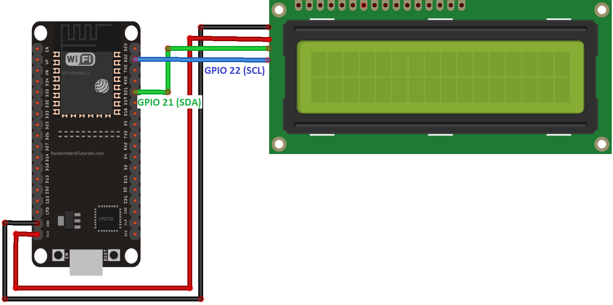

# Portaretratos HTTP

El programa trata de conectarse a una lista de redes WiFi. Cuando lo logra, imprime la dirección HTTP en pantalla con la nueva dirección de IP y muestra una foto cuando se accede desde un navegador.

